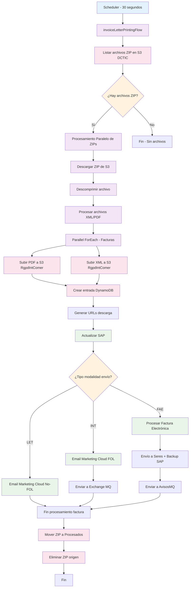

# Documentación Flujo sftp-facturas-Real-Sap-Flow

## Información General

**Proyecto:** ntgy-newco-p-sap-batch  
**Flujo Principal:** `sftp-facturas-Real-Sap-Flow`  
**Flujo Implementación:** `invoiceLetterPrintingFlow`  
**Tipo:** Proceso Batch de Facturación  
**Propósito:** Procesamiento automatizado de facturas para impresión y distribución

## Scheduler Principal

```xml
<flow name="sftp-facturas-Real-Sap-Flow">
    <scheduler doc:name="Scheduler">
        <scheduling-strategy>
            <fixed-frequency frequency="30" timeUnit="SECONDS"/>
        </scheduling-strategy>
    </scheduler>
    <flow-ref name="invoiceLetterPrintingFlow" />
</flow>
```

**Configuración del Scheduler:**
- **Frecuencia:** 30 segundos
- **Tipo:** Fixed frequency (intervalo fijo)
- **Estado:** Activo permanentemente

## Arquitectura del Proceso



## Flujo Detallado del Proceso

### 1. Inicialización
1. **Scheduler ejecuta** cada 30 segundos
2. **Configuración de variables**:
   - `parallelZips`: Número máximo de ZIPs en paralelo
3. **Listado de archivos** en S3 bucket DCTIC

### 2. Procesamiento de Archivos ZIP

#### 2.1. Descarga y Extracción
- **Origen**: S3 bucket `${s-s3.siteDCTIC.bucket}/${s-s3.siteDCTIC.invoicesPathIn}`
- **Filtro**: Archivos con extensión `.zip`
- **Límite**: Controlado por variable `maxConcurrencyZip`
- **Proceso**: Descompresión con extractor ZIP

#### 2.2. Procesamiento Paralelo de Facturas
- **Concurrencia**: Configurada por `${maxConcurrencyInvoice}`
- **Archivos objetivo**: XML de facturas dentro del ZIP
- **Validación**: Verifica existencia de PDF correspondiente

### 3. Gestión de Archivos S3

#### 3.1. Subida a S3 RgpdIntComer
```json
{
  "bucket": "${s-s3-facturas.siteRgpdintcomer.bucket}",
  "pdf_path": "{nif}/{factura_id}.pdf",
  "xml_path": "{nif}/{factura_id}.xml"
}
```

#### 3.2. Estructura de Archivos
- **Naming Convention**: `fact_{nif}_{num_factura}`
- **Organización**: Por NIF del cliente
- **Versionado**: Sobrescritura automática

### 4. Gestión de Tokens DynamoDB

#### 4.1. Estructura del Token
```json
{
  "token": "uuid_generado",
  "tokenExpirationDate": "fecha + 30 días",
  "documentType": "03.01",
  "docId": "base64(fact_nif_numfactura)",
  "contract": "numero_contrato",
  "nif": "nif_cliente",
  "invoiceNumber": "numero_factura",
  "cups": "cups",
  "sector": "tipo_factura",
  "iban": "iban_cliente",
  "dirFiscal": "direccion_fiscal",
  "dirSuministro": "direccion_suministro",
  "s3File": true
}
```

#### 4.2. Tabla DynamoDB
- **Nombre**: `ntgy-dydb-documents-token`
- **TTL**: 30 días
- **Propósito**: Control de acceso a documentos

### 5. Generación de URLs

#### 5.1. URLs de Descarga
- **SAP URL**: `${s-s3.downloadUrlNew}qt={token}&documentId={docId}&checkToken=No`
- **Cliente URL**: `${s-s3.downloadUrlNewOmega}qt={token}&documentId={docId}&checkToken=Yes`
- **Factura Interactiva**: `${s-s3.interactiveInvoiceUrl}qt={token}`
- **Omega URL**: `${s-s3.invoiceUrlOmega}{numero_factura}`

### 6. Integración con SAP

#### 6.1. Actualización de Estado
```json
{
  "invoiceNum": "numero_factura",
  "mktcResult": "",
  "mktcResultDesc": "",
  "s3Url": "url_descarga_sap",
  "timestampSH": "timestamp_procesamiento",
  "timestampMK": ""
}
```

#### 6.2. Endpoint SAP
- **Servicio**: `${ntgy-newco-s-sap-isu.path.feedbackImpresion}`
- **Método**: POST
- **Propósito**: Actualizar estado de procesamiento

### 7. Modalidades de Envío

#### 7.1. Modalidad INT (Factura On-Line)
- **Condición**: `MOD_ENV == "INT"`
- **Acción**: Envío email Marketing Cloud FOL
- **Event Key**: `${s-marketing-cloud.eventDefinitionKey}`
- **Datos adicionales**: Información completa de factura
- **Exchange**: Envío a `${anypointMQ.exchangeFact}` con properties `AvisosMadison: true`

#### 7.2. Modalidad LET (Experiencia Digital)
- **Condición**: `MOD_ENV == "LET"`
- **Acción**: Envío email Marketing Cloud No-FOL
- **Event Key**: `${s-marketing-cloud.eventDefinitionKeyNoFol}`
- **Diferencias**: Sin envío a Exchange

#### 7.3. Modalidad FAE (Factura Electrónica)
- **Condición**: `MOD_ENV == "FAE"`
- **Proceso complejo**:
  1. Buscar XML original en SAP FTP
  2. Leer y procesar Factura-E
  3. Insertar PDF en XML como attachment
  4. Generar nombre según formato Seres
  5. Subir a FTP Seres
  6. Mover original a backup
  7. Enviar a cola de avisos

##### Formato Nombre Seres
```
{sistemaEmisor}#{IDFactura}#{NIFEmisor}#{CIFReceptor}#{fechaEmision}.xml
```

### 8. Procesamiento Marketing Cloud

#### 8.1. Datos Enviados
```json
{
  "ContactKey": "nif_cliente",
  "EventDefinitionKey": "clave_evento",
  "Data": {
    "SubscriberKey": "nif_cliente",
    "cups": "cups",
    "numeroContrato": "contrato",
    "numeroCuentaContrato": "cuenta_contrato",
    "direccionCompleta": "direccion_suministro",
    "importeTotalFactura": "importe",
    "fechaEmision": "fecha_emision",
    "fechaCargo": "fecha_cargo",
    "linkPdf": "url_cliente",
    "urlFI": "url_interactiva",
    "numeroFactura": "numero",
    // ... campos adicionales
  }
}
```

#### 8.2. Campos Especiales
- **Fechas**: Formateo específico según idioma
- **Facturas SD**: Lógica especial para tipos AS/AG/AT/AL/FS/FG/FT/FL/SS/SG/ST/SL
- **Idiomas**: Soporte Z2 (catalán) y otros
- **Flags especiales**: ECO, PORTADO, empleado, etc.

### 9. Manejo de Errores

#### 9.1. Tipos de Errores
- **APP:DYNAMO_ERROR**: Error guardando token
- **APP:SAP_ERROR**: Error comunicando con SAP
- **APP:MARKETING_CLOUD_ERROR**: Error enviando email
- **APP:S3_UPLOAD_FILE**: Error subiendo archivos
- **APP:GENERATE_DOCUMENT_ERROR**: Error generando documentos
- **APP:AVIVA_ERROR**: Error en proceso de firma

#### 9.2. Cola de Reintentos
- **Destino**: `envioColaReintentosSub_Flow`
- **Datos**: Información completa del error para reintento
- **Trazabilidad**: Headers trace parent para seguimiento

#### 9.3. Logging
- **Nivel**: INFO para flujo normal, ERROR para excepciones
- **Contenido**: Estados de procesamiento, errores específicos
- **Exclusiones**: PDFs en logs por tamaño

### 10. Gestión de Archivos

#### 10.1. Archivos Procesados
- **Destino**: `${s-s3.siteDL.processedInvoices}`
- **Propósito**: Auditoría y trazabilidad
- **Retention**: Según políticas S3

#### 10.2. Archivos No Procesados  
- **Destino**: `${s-s3.siteDL.unprocessedInvoices}`
- **Condición**: Error en procesamiento
- **Propósito**: Reintento manual

#### 10.3. Limpieza
- **Origen eliminado**: Después de procesamiento exitoso
- **Processing eliminado**: Siempre al final
- **Backup**: Archivos originales XML movidos a carpeta backup

### 11. Configuración de Propiedades

#### 11.1. S3 Configuración
```yaml
s-s3:
  siteDCTIC:
    bucket: "bucket_origen"
    invoicesPathIn: "path_entrada/"
  siteDL:
    bucket: "bucket_procesados"
    processedInvoices: "processed/"
    unprocessedInvoices: "unprocessed/"
    processingInvoices: "processing/"

s-s3-facturas:
  siteRgpdintcomer:
    bucket: "bucket_facturas"
```

#### 11.2. Servicios Externos
```yaml
ntgy-newco-s-sap-isu:
  path:
    feedbackImpresion: "/feedback/impresion"

s-marketing-cloud:
  eventDefinitionKey: "clave_fol"
  eventDefinitionKeyNoFol: "clave_no_fol"

ntgy-newco-s-ftp:
  sap:
    pathFacturaE: "path_factura_e/"
    pathBck: "backup/"
  seres:
    pathXMLin: "entrada_xml/"
```

#### 11.3. Concurrencia
```yaml
maxConcurrencyZip: "numero_zips_paralelo"
maxConcurrencyInvoice: "numero_facturas_paralelo"
```

### 12. Integraciones Externas

#### 12.1. S3 (Almacenamiento)
- **Buckets múltiples**: DCTIC, DL, RgpdIntComer
- **Operaciones**: LIST, GET, PUT, DELETE
- **Timeouts**: 240 segundos para operaciones grandes

#### 12.2. DynamoDB (Tokens)
- **Tabla**: ntgy-dydb-documents-token
- **Operación**: INSERT con validación
- **TTL**: 30 días automático

#### 12.3. SAP ISU (ERP)
- **Feedback procesamiento**: Estado y URLs
- **Timeout**: Estándar HTTP
- **Reintentos**: 3 intentos con 10s entre reintentos

#### 12.4. Marketing Cloud (Email)
- **API**: Envío de eventos
- **Personalización**: Según datos cliente
- **Credenciales**: Configuración "impresion"

#### 12.5. FTP SAP (Archivos)
- **Origen**: Facturas electrónicas
- **Backup**: Movimiento automático post-procesamiento
- **Paths configurables**: Por entorno

#### 12.6. FTP Seres (Factura Electrónica)
- **Destino**: Plataforma gubernamental
- **Formato**: XML con PDF embebido
- **Naming**: Formato específico requerido

#### 12.7. AnyPoint MQ (Eventos)
- **Colas**: Exchange facturación, avisos
- **Propósito**: Desacoplamiento de procesos
- **Persistencia**: Configuración MQ

### 13. Monitoreo y Observabilidad

#### 13.1. Métricas Clave
- **Archivos procesados**: Count por ejecución
- **Tiempo procesamiento**: Por ZIP y por factura
- **Errores**: Por tipo de error
- **Throughput**: Facturas por hora

#### 13.2. Logs Estructurados
- **Inicio/Fin**: De cada fase del proceso
- **Errores específicos**: Con contexto completo
- **Trazabilidad**: Correlation IDs y trace parents

#### 13.3. Alertas Recomendadas
- **Errores recurrentes**: Más de X errores en Y minutos
- **Latencia alta**: Procesamiento > threshold
- **Fallos integración**: SAP, Marketing Cloud, S3 no disponibles

### 14. Consideraciones de Rendimiento

#### 14.1. Paralelización
- **Nivel ZIP**: Configuración `maxConcurrencyZip`
- **Nivel Factura**: Configuración `maxConcurrencyInvoice`
- **Scatter-Gather**: Para operaciones independientes

#### 14.2. Gestión de Memoria
- **Limpieza variables**: Removal explícito de variables grandes
- **Streaming**: Para archivos grandes
- **Timeouts**: 240s para operaciones S3 grandes

#### 14.3. Reintentos
- **Until Successful**: 3 reintentos con 10s intervalo
- **Operaciones críticas**: S3, SAP, DynamoDB
- **Excepciones**: Marketing Cloud (continúa con errores)

### 15. Casos de Uso y Escenarios

#### 15.1. Procesamiento Normal
1. ZIP llega a S3 DCTIC
2. Scheduler detecta archivo
3. Procesamiento exitoso
4. Cliente recibe email
5. Archivo movido a procesados

#### 15.2. Factura Electrónica
1. ZIP con MOD_ENV="FAE"
2. Búsqueda XML en SAP
3. Generación Factura-E con PDF
4. Envío a Seres
5. Actualización estado SAP

#### 15.3. Error de Procesamiento
1. Error en fase específica
2. Log de error detallado
3. Envío a cola reintentos
4. Archivo movido a no procesados
5. Alertas activadas

#### 15.4. Sin Archivos
1. Scheduler ejecuta
2. No encuentra ZIPs
3. Finalización inmediata
4. Sin logging adicional

### 16. Mantenimiento y Operaciones

#### 16.1. Configuración Entornos
- **Paths específicos**: Por entorno (dev, pre, pro)
- **Buckets diferenciados**: Para cada ambiente
- **Credenciales**: Separadas por entorno

#### 16.2. Backup y Recovery
- **Archivos backup**: En SAP FTP backup folder
- **Logs persistentes**: Para auditoría
- **Estados en SAP**: Para recuperación estado

#### 16.3. Escalabilidad
- **Horizontal**: Ajuste parámetros concurrencia
- **Vertical**: Recursos CloudHub
- **Storage**: Gestión lifecycle S3

Este flujo representa un componente crítico del sistema de facturación de Naturgy, manejando el procesamiento completo desde archivos ZIP hasta la distribución final a clientes, con múltiples canales de entrega y robusta gestión de errores.